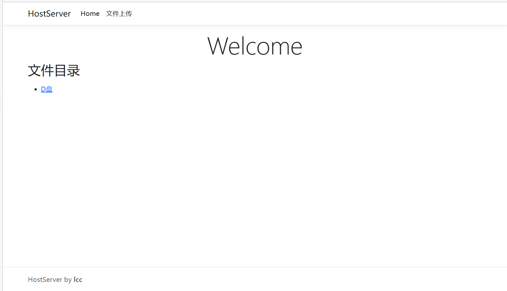
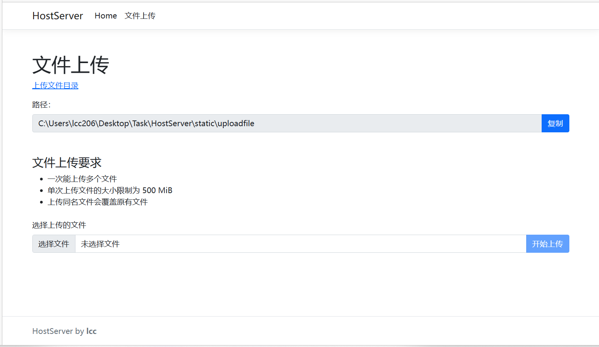
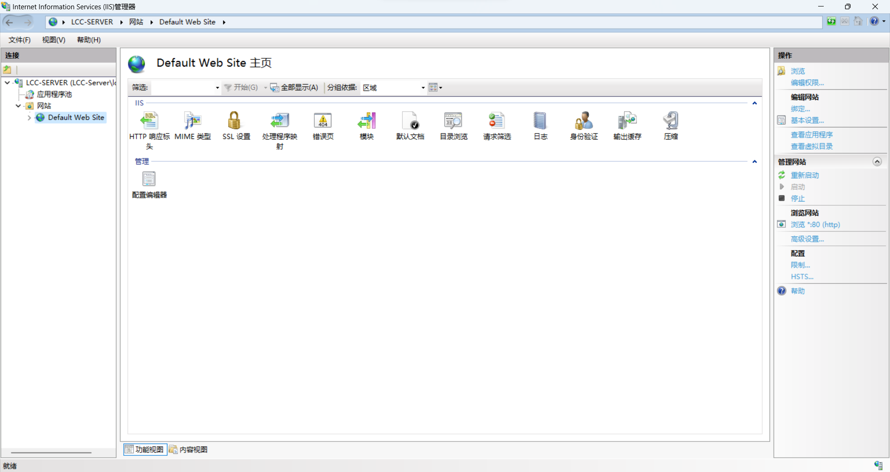
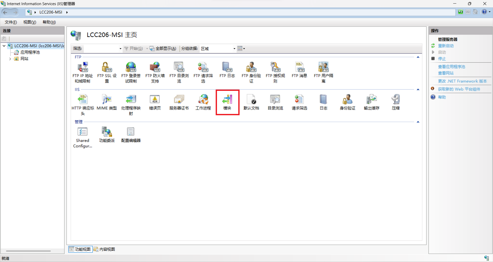
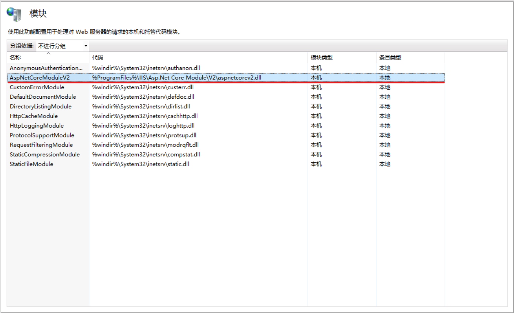
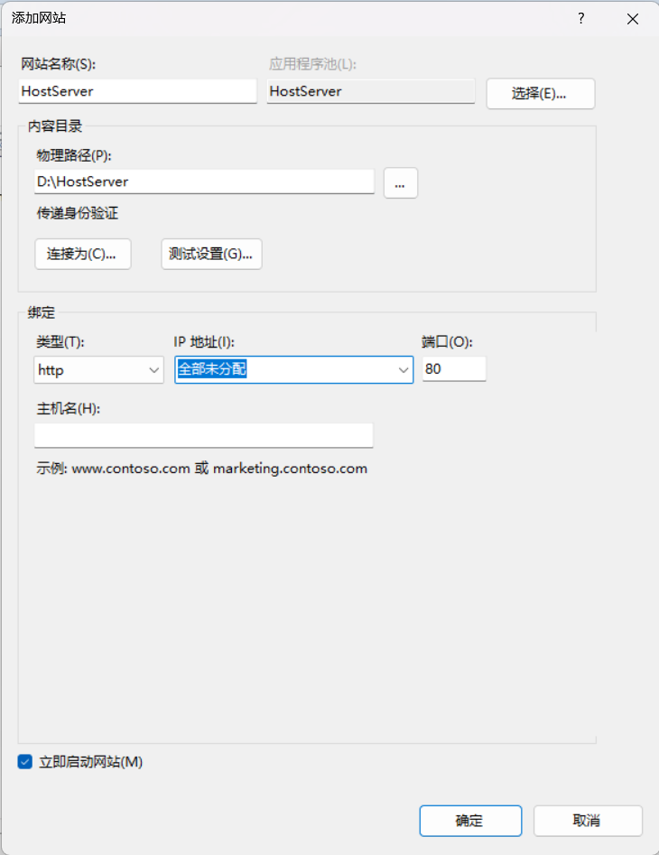
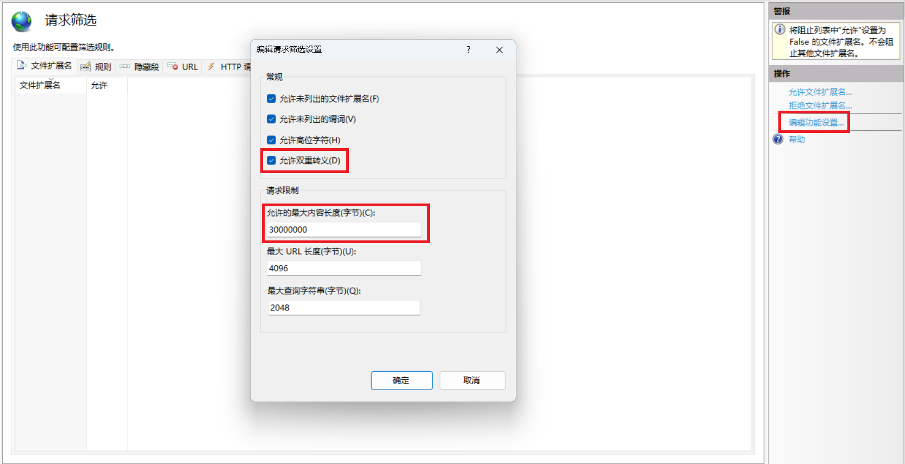

# HostServer

HostServer 是一个用于部署在本机（无论是服务器、还是个人电脑）上的 Web 应用，开发它的本意是帮助使用者更加快捷方便的访问共享的资源，减少重复的工作，提升效率。

## 概览

主页 - 访问静态文件



上传文件至指定目录



## 要求

HostServer 目前部署的最佳实践

- Windows 10/11 系统
- 启用 Windows IIS（Internet Information Services） 功能，使用 IIS 托管 Web 应用
- （必需）**生成**项目需要 .NET SDK 7；**运行** Web 应用需要 ASP.NET Core Runtime 7，在 Windows 上，建议安装 Hosting Bundle 运行时安装包，因为其提供了 .NET Runtime 和 IIS 模块支持。[Download .NET 7.0 (Linux, macOS, and Windows) (microsoft.com)](https://dotnet.microsoft.com/en-us/download/dotnet/7.0)
- Node.js，使用 Node 来编译 typescript 文件，推荐使用 nvm 来安装 Node.js。[coreybutler/nvm-windows: A node.js version management utility for Windows. Ironically written in Go. (github.com)](https://github.com/coreybutler/nvm-windows)
- Powershell，该项目使用 Powershell 来生成和部署项目

ASP.NET Core 是支持跨平台的 Web 应用框架，该项目也可以部署到其他系统上，使用 IIS 托管也不是唯一的选择。

## 部署

按照部署的最佳实践，使用 Windows 10系统部署，使用 IIS 托管 Web 应用。

### 生成可执行文件（可选）

使用 dotnet 命令检查运行时版本（请查看要求是否满足）：

```
dotnet --list-runtimes
```

使用 git 拷贝项目

```shell
mkdir BuildFolder
cd ./BuildFolder
git clone https://github.com/lcclcclcc206/HostServer.git
cd HostServer
```

设置脚本执行策略

```powershell
# 该命令需要管理员权限
Set-ExecutionPolicy RemoteSigned
```

生成可执行文件（可选，因为部署脚本 Deploy.ps1 包含这一步）

```powershell
.\publish.ps1
```

生成并部署

```powershell
.\Deploy.ps1
```

> 该脚本会默认将可执行文件部署到 `D:\HostServer` 上，如果需要自定义部署位置，请修改脚本。（如果要部署到 C 盘，需要对部署的文件夹添加 Authenticated Users 用户修改等权限，如果部署失败，请进行检查，重启命令行后重试）

### 配置并启动服务

如果选择直接下载项目生成的文件，请将文件放置于部署的文件夹中。

HostServer 需要配置文件来映射对应的空间，在部署的文件夹中新建 Configuration 文件夹，新建 staticfile.json 文件，以下为示例

staticfile.json

```json
{
  "Universal": [
    {
      "DisplayName": "D:",
      "RootPath": "D:/",
      "RequestPath": "/static"
    }
  ],
  "UploadFile": {
    "RootPath": "./static/uploadfile",
    "RequestPath": "/static/uploadfile",
    "FileSizeLimit": 10485760
  }
}
```

在 staticfile.json 中：

- Universal 代表的是映射的通用文件夹，这些文件夹的链接会在主页上显示，请注意，Universal 能映射多个文件夹。如果因为权限或者路径错误的原因导致映射失败，HostServer 不会显示该链接。

  - DisplayName 代表链接显示的名字

  - RootPath 代表映射文件夹的路径

    > 在 Windows 上，如果映射了 C 盘的文件夹，需要对相应文件夹添加 Authenticated Users 用户的修改读取等权限

  - RequestPath 代表 url 路径

- UploadFile 代表的是上传文件的文件夹，上传的文件将存放在这个地方，并且，使用者可以设置文件大小的限制

  - RootPath 和 RequestPath 与 Universal 设置的含义相同
  - FileSizeLimit，每次上传文件的大小限制，单位是字节 Byte

#### 使用 IIS 托管应用

打开 IIS 管理器，查看当前部署的网站，请将不需要的网站停止或删除



例如，将默认的网站 Default Web Site 停用或删除

在部署网站之前，请检查 AspNetCoreModule 是否安装

IIS 主页 > 模块





在左边的连接管理栏，右键网站，选择添加网站，参考配置如下：



关于 IP 地址分配，如果选择未分配，则主机所有 IP 地址都会分配给该网站。

部署完后，还要修改其他的配置，如下：

在主页中选择请求筛选，选择编辑功能设置，选择双重转义和允许的最大内容长度（与上传的最大文件大小相关）。



配置完后即可访问网站主页查看效果

